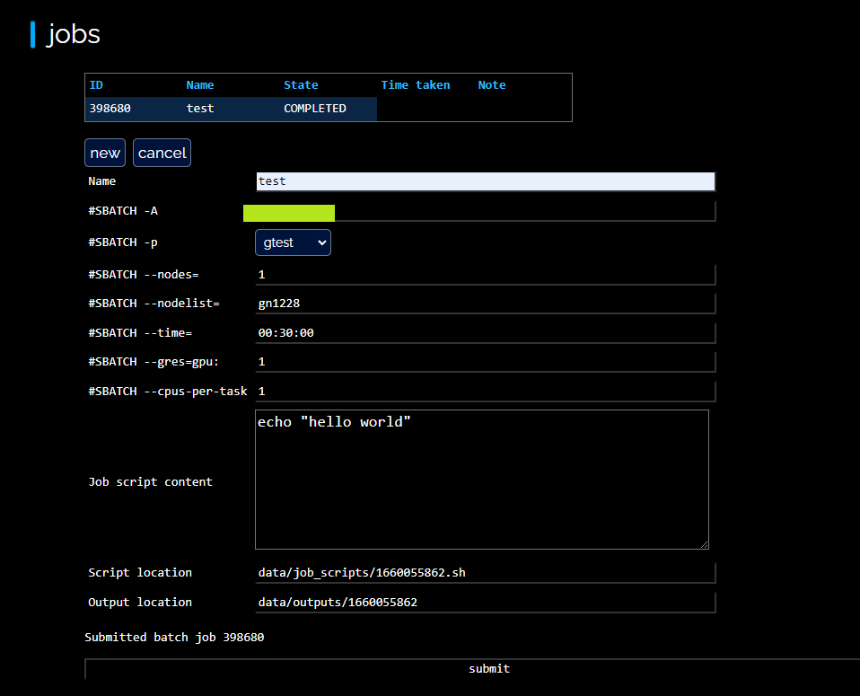
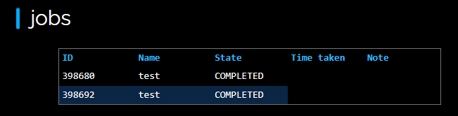

## Installation

1. Clone the repo. Run `cd slurm_gui`.

2. Run `conda create --name slurmgui python=3.9.0 && conda activate slurmgui`.

3. Run `pip install -r requirements.txt`.

4. Set the password with `python reset_password.py <your password>`.

5. Open `config.json` in the root folder, and set the defaults.account field to your slurm project/account id.

## Usage

1. Start the app with `python main.py`.

2. Go to `https://127.0.0.1:15001/`. Log in and go to "slurm".

> **_NOTE:_**  If the page does not load completely, please reload it

3. Click "new" button to open the form for submitting jobs. Fill out the form and click "submit" to submit the job to slurm.

4. Inspect the submitted job by selecting it in the list.

5. To cancel a job that is pending or running, select the job and click the 'cancel' button.

